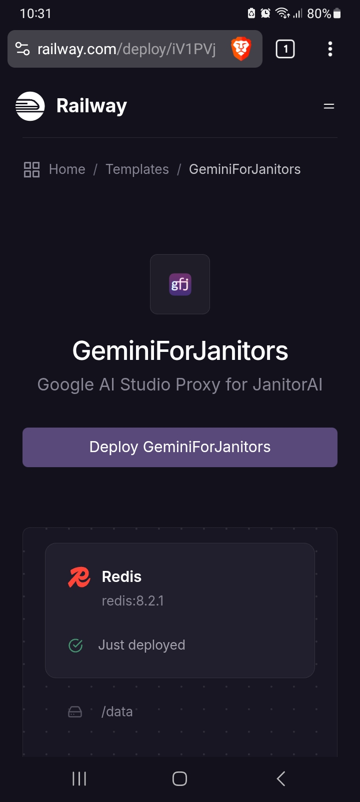
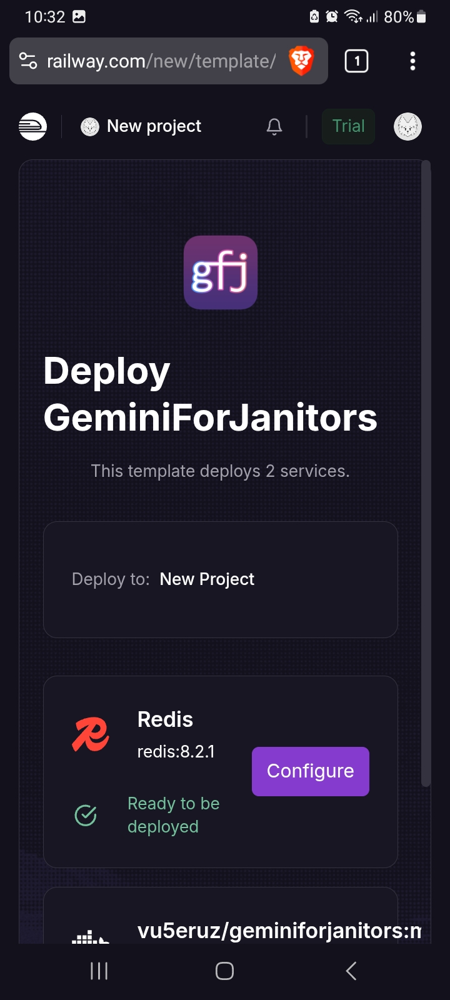
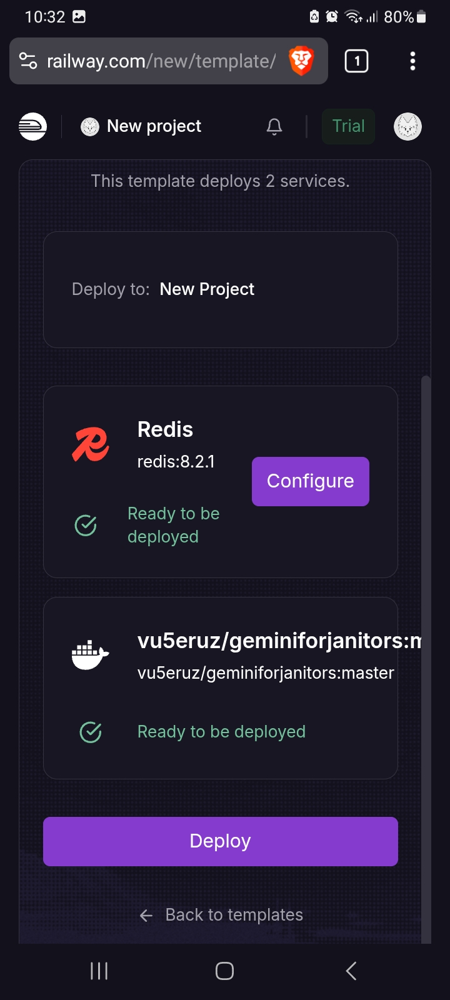
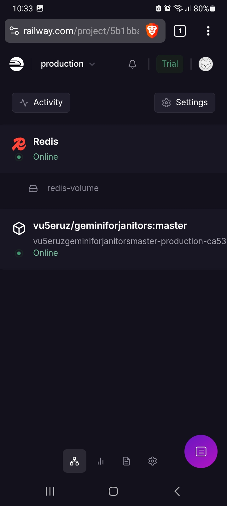
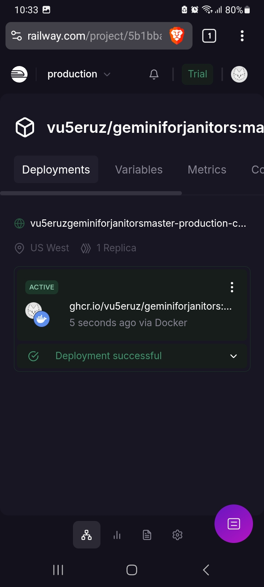
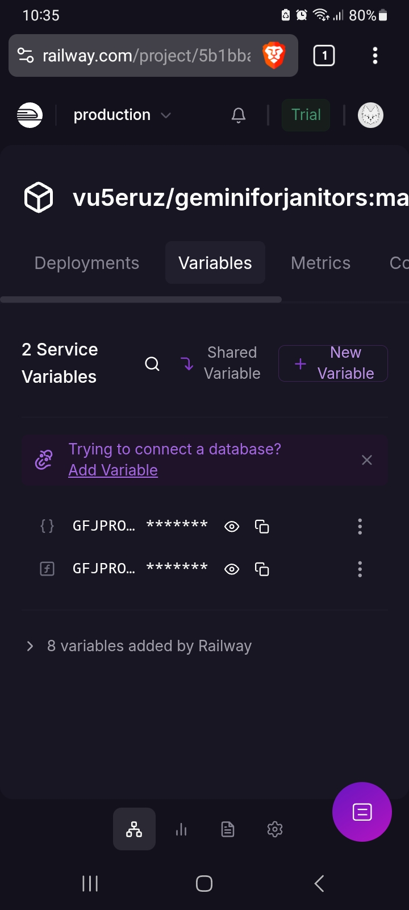
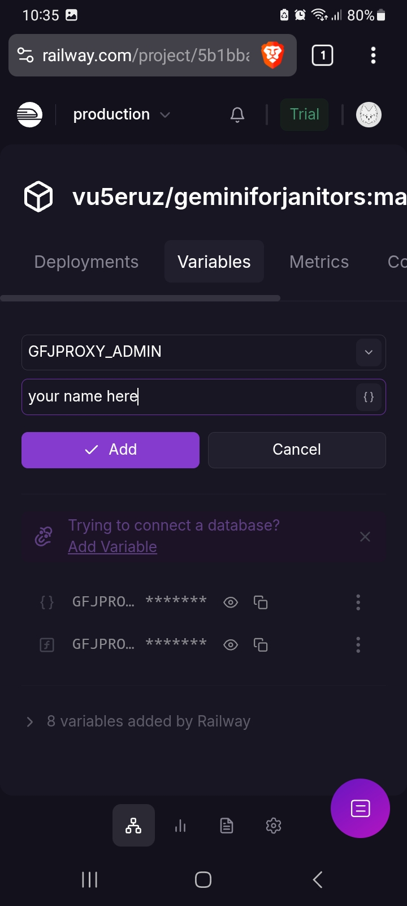
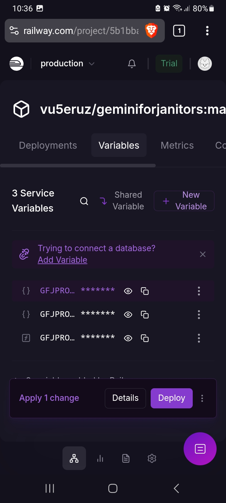

<div align="center">
  
  <h1>GeminiForJanitors</h1>
  <p>Google AI Studio Proxy for JanitorAI</p>
</div>

<hr />

- [Running locally](#running-locally)
- [Deploying on Railway](#deploying-on-railway)
- [Deploying on Render](#deploying-on-render)
- [Adaptive Cooldown](#adaptive-cooldown)

## Running locally

To run GeminiForJanitors on your desktop computer or on your phone, you need three things:

- `uv` with Python 3.13 or greater installed.
- A program that can generate tunnel URLs for your proxy, such as `cloudflared` or `localtunnel`.
- A copy of GeminiForJanitors' source code, which you can get through `git` or by manually downloading and unzipping the source from GitHub.

To run the proxy locally, you should know how to use the command line, such as `cmd.exe` or `powershell.exe`/`pwsh.exe` on Windows, or the terminal on Linux/MacOS, or Termux on Android.

### Installing `uv` and Python

Go to https://docs.astral.sh/uv/getting-started/installation/ and follow the guide for your operating system. In the case of Termux, you should instead run `pkg install -y uv python`. After that, you should then be able to run `uv` from the command line.

Next, run this command and take note of what Python version(s) you have installed:

```sh
uv python list
```

If you don't have any Python version installed, run this command:

```sh
uv python install 3.13
```

### Installing a Tunneling Program

To use the proxy from outside your local network, you need a program that can tunnel external connections into your device for the proxy to handle. Programs such as `cloudflared` or `localtunnel` can do this, as well as many others. GeminiForJanitors has special support for `cloudflared`, but any tunneling program that you can run on your device should work just fine.

To use `cloudflared`, go to https://github.com/cloudflare/cloudflared/releases/ and download the appropriate executable for your operating system. In the case of Termux, you should instead run `pkg install -y cloudflared`.

Take note of the location where you downloaded the executable, e.g. `C:\Users\YourName\Downloads\cloudflared-windows-amd64.exe`. To get the location on Termux, you can run `type cloudflared` which should give you something like this:

```
cloudflared is hashed (/data/data/com.termux/files/usr/bin/cloudflared)
```

In the case of other tunneling programs, you might have to open two separate command lines: one for running GeminiForJanitors, and one for running the tunnel. The exact commands depend on the program. With `localtunnel`, for example, you need to install NodeJS and `npm`, then run `npm install -g localtunnel`, then on the second command line run:

```sh
lt --port 5000
```

After starting GeminiForJanitors.

### Downloading GeminiForJanitors

If you have `git` installed on your command line, you can run the following command:

```
git clone --depth=1 https://github.com/vu5eruz/GeminiForJanitors.git
```

This will download a copy of GeminiForJanitors on your device, and you can update this copy by running `git pull` inside its folder.

Alternatively, you can open this link https://github.com/vu5eruz/GeminiForJanitors/archive/refs/heads/master.zip to download a copy. This is a zip file from which you can extract a folder with GeminiForJanitors' source code. This copy cannot be updated without downloading a new one.

### Running GeminiForJanitors

Make sure your command line's current working directory is within your copy's folder.

By default, GeminiForJanitors expects to have a Redis database. This is not necessary for running locally, so to disable this, you need to run the following command depending on your operating system:

```sh
# if you are on Linux/MacOS/Termux
export GFJPROXY_DEVELOPMENT=y
```

```bat
:: if you are on Windows using cmd.exe
set GFJPROXY_DEVELOPMENT=y
```

```powershell
# if you are using powershell.exe/pwsh.exe
$env:GFJPROXY_DEVELOPMENT = 'y'
```

If you are using `cloudflared`, you need to set `GFJPROXY_CLOUDFLARED` to the location of the executable, as follow:

```sh
# if you are on Linux/MacOS/Termux
export GFJPROXY_CLOUDFLARED='/data/data/com.termux/files/usr/bin/cloudflared'
```

```bat
:: if you are on Windows using cmd.exe
set GFJPROXY_CLOUDFLARED=C:\Users\YourName\Downloads\cloudflared-windows-amd64.exe
```

```powershell
# if you are using powershell.exe/pwsh.exe
$env:GFJPROXY_CLOUDFLARED = 'C:\Users\YourName\Downloads\cloudflared-windows-amd64.exe'
```

After that, you are ready to run GeminiForJanitors. On Termux, you might have issues running the proxy since your installed Python version might not be 3.13; in this case, make sure to include the `--python 3.13` part, and change `3.13` to whichever version you have installed. If you have Python 3.13 installed, you can omit it.

```sh
uv run --python 3.13 --no-dev flask --app "gfjproxy.app:create_app()" run -h 127.0.0.1 -p 5000
```

## Deploying on Railway

You must first create a Railway account. On the free tier, its resource limits get reduced after one month, but it should always be capable of hosting one proxy instance. Once you are logged in, go to https://railway.com/deploy/iV1PVj and then press **Deploy Now**.



If you see this next screen, press **Deploy**.

<p align="center">

&nbsp; &nbsp;

</p>

With this, your proxy should be up and running shortly. Once it is done deploying, tap on the cube icon that says **vu5eruz/geminiforjanitors:master** to open your service settings.



In your service settings, you can copy and paste your proxy's URL. It is ready to use, however, the proxy will say it is hosted by Anonymous; if you want to change that, go to **Variables**.



Here, you can configure a few proxy settings. The two variables that come by default (`GFJPROXY_REDIS_URL` and `GFJPROXY_XUID_SECRET`) should NOT be changed, as doing so can break the proxy. To make the proxy identify as yours, first press **New Variable**.



Put `GFJPROXY_ADMIN` as the variable name. Then put your contacts into the value, such as Discord or JanitorAI handles or just your name, and press **Add**.



After you are done, press **Deploy** to commit the changes, then wait for your proxy to update.



## Deploying on Render

You must first create a Render account, bound to a monthly 5 GB bandwidth quota if you use the free tier, with which you will be able to host one proxy instance. If you see this screen after signing in, press **Skip**.


You should make it to your dashboard or workspace page, then go to the **Blueprints** tab.


Once you are in the New Blueprint page, copy-paste https://github.com/vu5eruz/GeminiForJanitors into the **Public Git Repository** field and press **Continue**.


Put "gfjproxy" (without quotes) into **Blueprint Name**.

Put your contacts into the value of **GFJPROXY_ADMIN**, such as your Discord or JanitorAI handles or just your name, otherwise your proxy will say it is hosted by Anonymous.

Put how long the cooldown time will be _in seconds_ into the value of **GFJPROXY_COOLDOWN**. This will help reduce the load on your proxy if you have a large number of users and you are bound to the 5 GB bandwidth quota.

If you have a Render API key for your account (you can get one in https://dashboard.render.com/u/settings?add-api-key), you can put it into the value of **GFJPROXY_RENDER_API_KEY** to make your proxy track its own bandwidth usage, enabling _adaptive cooldown_.


With this, your proxy should be up and running shortly. If you go back to your dashboard/workspace, you can click on **GeminiForJanitors** (not to be confused with _GeminiForJanitors-redis_) and see your URL, as well as have access to the proxy's Logs and Metrics tabs.


Use the **Logs** tab to see how people use your proxy and diagnose any errors. Use the **Metrics** tab to see how much bandwidth has been used.

You can change the cooldown time anytime by going into the **Environment** tab and changing the value of GFJPROXY_COOLDOWN.

## Adaptive Cooldown

It is possible to make the proxy apply a cooldown only if the bandwidth usage is above a given value by configuring the GFJPROXY_COOLDOWN value. For example, consider the following _cooldown policy_:

- Apply a 30-seconds cooldown by default.
- Apply a 60-seconds cooldown if bandwidth usage is above 70 GB.
- Apply a 90-seconds cooldown if bandwidth usage is above 80 GB.

To set up such a policy, set GFJPROXY_COOLDOWN to:

```
30, 60:70, 90:80
```

Then deploy your instance. You can read the logs for `Using cooldown policy` to see if your changes have been applied.
